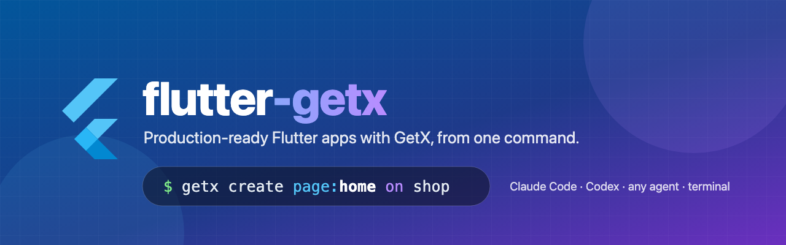

<p align="center">
  
</p>

<p align="center">
  <a href="https://github.com/farhansadikgalib/flutter-getx/releases"></a>
  <a href="skills/flutter-getx/LICENSE.txt"></a>
  <a href="#claude-code"></a>
  <a href="#codex-and-other-agents"></a>
  <a href="https://flutter.dev"></a>
  <a href="https://pub.dev/packages/get"></a>
</p>

**flutter-getx** builds production-ready Flutter apps on GetX. It creates a clean folder pattern and pins every package to its
latest pub.dev release. Then it adds pages, API screens, models and translations with the commands you already know from
[get_cli](https://pub.dev/packages/get_cli).

It works the same way in three places: Claude Code (slash commands), Codex or any other agent (an Agent Skill), and your
terminal (`getx`).

```text
getx create project:my_shop
getx create page:cart on home
getx create feature:products with https://fakestoreapi.com/products
getx generate model:Product with product.json
getx install fcm
```

## If you know get_cli, you know this

| get_cli | flutter-getx | What's different |
| --- | --- | --- |
| `get create project` | `getx create project:my_shop` | One step, no prompts. Latest packages, analyze and tests pass. |
| `get init` | `getx init` | Never overwrites your edited files |
| `get create page:cart on home` | `getx create page:cart on home` | Controller and view extend `BaseController` / `BaseView` |
| `get create controller:edit on profile` | `getx create controller:edit on profile` | Registered in the module binding |
| `get create view:edit on profile` | `getx create view:edit on profile` | Compiles against the module's controller |
| `get generate model on home with user.json` | `getx generate model:User with user.json` | Works on Dart 3; also from a URL or pasted JSON |
| `get generate locales assets/locales` | `getx generate locales` | Same output; works without get_cli |
| `get install lottie` | `getx install lottie` | Latest stable version |
| | `getx create feature:posts with <url>` | API screen with loading, error, empty and refresh states, plus tests |
| | `getx create string:checkout "Checkout" --ar "الدفع"` | Every locale updated, keys regenerated |
| | `getx install fcm` | Firebase push notifications, wired in |
| | `getx upgrade` / `getx doctor` | Modernize old projects / check your setup |

In Claude Code, put `/flutter-getx:` in front instead of `getx`:
`/flutter-getx:create page:cart on home`.

## Quick start

### Claude Code

```text
/plugin marketplace add farhansadikgalib/flutter-getx
/plugin install flutter-getx@flutter-getx
```

```text
/flutter-getx:create project:my_shop
/flutter-getx:create feature:products with https://fakestoreapi.com/products
/flutter-getx:create page:profile showing the saved user's email with a logout button
```

The script does the scaffolding and Claude does the rest. Here Claude implements the profile page you described,
translates new strings, and fixes anything `flutter analyze` reports. Plain language works too: *"Create a Flutter app
with GetX, dark mode and Arabic"* triggers the skill without a command.

Six commands: `create`, `generate`, `init`, `install`, `upgrade`, `doctor`.

### Codex and other agents

Install the skill with [skills.sh](https://skills.sh):

```bash
npx skills add farhansadikgalib/flutter-getx --agent codex   # or --agent claude-code, or '*' for all
```

For Codex this puts the skill in `.agents/skills/flutter-getx`. The agent reads `SKILL.md` and runs commands like:

```bash
python3 .agents/skills/flutter-getx/scripts/getx.py create page:cart --json --yes
```

With `--json`, stdout is exactly one JSON object and progress goes to stderr:

```json
{
  "command": "getx create page:cart",
  "ok": true,
  "created": ["lib/app/modules/cart/controllers/cart_controller.dart", "..."],
  "modified": ["lib/app/routes/app_routes.dart", "lib/app/routes/app_pages.dart"],
  "skipped": [],
  "next": ["flutter analyze"],
  "route": "Routes.CART"
}
```

Exit codes: `0` success, `1` the operation failed, `2` invalid usage. On exit 2 the `error` field contains the corrected
command. Nothing ever waits for input once the arguments are given.

### Terminal

```bash
git clone https://github.com/farhansadikgalib/flutter-getx.git
flutter-getx/bin/getx install-cli        # writes ~/.local/bin/getx
getx doctor
getx create project:my_shop && cd my_shop
getx create page:cart
```

`getx help` and `getx help <verb>` show every option. Add `--dry-run` to any command to preview changes without writing.
A typo gets a suggestion:

```text
$ getx creat page:cart
getx: unknown command 'creat'. Did you mean: getx create page:cart
```

## Commands

```text
getx <verb> [<target>:<name>] [on <module>] [with <source>] [flags]
```

| Command | What it does |
| --- | --- |
| `create project:<name>` | New app with the pattern, latest packages and generated code. `--org com.acme`, `--platforms android,ios,web`, `--title "My Shop"`, `--design-size 390x844`, `--dir <parent>` |
| `create page:<name> [on <module>]` | Binding, controller, view and route; nested routes with `on` |
| `create controller:<name> on <module>` | Controller registered in the module's binding |
| `create view:<name> on <module>` | Extra view in a module, not routed |
| `create feature:<name> with <url\|file\|json>` | API list screen: model, data source, controller with states, view with pull-to-refresh, route, tests |
| `create string:<key> "<text>" [--ar "..."]` | String in every locale, `LocaleKeys` regenerated |
| `generate model:<Class> with <url\|file\|json> [on <module>]` | Null-safe model with `fromJson`, `toJson`, `copyWith`; nested objects become classes. `--nullable a,b`, `--force` |
| `generate locales` | `lib/generated/locales.g.dart` from `assets/locales/*.json` |
| `init` | Adds the pattern to an existing Flutter app |
| `install <package> [--dev]` | Latest stable version, then `flutter pub get` |
| `install fcm` | Firebase Cloud Messaging: packages, helpers, `main.dart` wiring, iOS Podfile, placeholder options |
| `upgrade` | Latest packages, hive to hive_ce, deprecated API fixes, and an analyzer report |
| `doctor` | Checks Flutter, Dart, Python, get_cli and pub.dev, and audits the project |

Global flags: `--project <dir>`, `--dry-run`, `--json`, `--yes`, `--offline`, `--no-get-cli`.

## What you get

```text
lib/
├── main.dart                 Hive + SharedPreferences init, ScreenUtil, GetMaterialApp
├── app/
│   ├── components/           error widget with retry, loading overlay, snackbars, state animator
│   ├── core/
│   │   ├── base/             BaseController (page state, logger), BaseView (scaffold, offline banner)
│   │   ├── binding/          InitialBinding for app-wide services
│   │   └── connection_manager/  live connectivity status
│   ├── data/
│   │   ├── local/            Hive CE and SharedPreferences wrappers
│   │   ├── models/           models and generated adapters
│   │   └── remote/           one data source per API resource
│   ├── modules/home/         binding · controller · view
│   ├── routes/               routes managed by get_cli
│   └── services/             Dio client: typed errors, timeouts, debug logging
├── config/
│   ├── theme/                light and dark themes, saved toggle, ThemeExtensions
│   └── translations/         JSON-driven locales (English, Arabic, RTL)
└── generated/locales.g.dart  LocaleKeys
```

The project also includes tests for the home screen, the theme toggle, the API client, Hive storage and the language switch.

What's built in:

- Every package resolves to its latest stable version when you run the command, with a dated offline fallback.
- It uses current Flutter APIs throughout: `WidgetStateProperty`, `withValues`, `TextScaler` and list-based connectivity results.
- Local storage uses the maintained `hive_ce` instead of the abandoned `hive`.
- Android release builds and macOS get the network access that `flutter create` leaves out.

## Other ways to install

- **claude.ai:** download `flutter-getx.skill` from the [latest release](https://github.com/farhansadikgalib/flutter-getx/releases/latest)
  and upload it under **Settings, then Capabilities, then Skills**. claude.ai can't run Flutter, so there the skill
  guides you and writes code rather than running `getx`.
- **Claude API:** upload the same file. No beta header is needed.

  ```bash
  curl -X POST "https://api.anthropic.com/v1/skills" \
    -H "x-api-key: $ANTHROPIC_API_KEY" -H "anthropic-version: 2023-06-01" \
    -F "files[]=@flutter-getx.skill;filename=flutter-getx.zip"
  ```

- **Manual:** copy `skills/flutter-getx` to `~/.claude/skills/` (Claude Code) or to `.agents/skills/` (Codex).

## Upgrading from 0.2

Version 0.3 replaces the nine 0.2 commands with six commands that follow get_cli's grammar:

| 0.2 | 0.3 |
| --- | --- |
| `/flutter-getx:new my_shop` | `/flutter-getx:create project:my_shop` |
| `/flutter-getx:page cart --on home` | `/flutter-getx:create page:cart on home` |
| `/flutter-getx:feature products <url>` | `/flutter-getx:create feature:products with <url>` |
| `/flutter-getx:model <json> Product` | `/flutter-getx:generate model:Product with <json>` |
| `/flutter-getx:string key "Text"` | `/flutter-getx:create string:key "Text"` |
| `/flutter-getx:fcm` | `/flutter-getx:install fcm` |
| `/flutter-getx:init`, `:upgrade`, `:doctor` | unchanged |

## Requirements

| Tool | Version | Notes |
| --- | --- | --- |
| Flutter | stable 3.x (verified on 3.47.5) | `flutter` on PATH |
| Dart | 3.x (verified on 3.13.4) | ships with Flutter |
| Python | 3.9 or newer | standard library only |
| get_cli | 1.9.1, optional | used when present; bundled templates otherwise |

## Troubleshooting

| Problem | Fix |
| --- | --- |
| `get: Invalid kernel binary format version` | Your get_cli predates your Dart SDK. Run `dart pub global activate get_cli`, or pass `--no-get-cli`. |
| `getx: command not found` | Run `bin/getx install-cli` and add `~/.local/bin` to PATH, or call `python3 <skill>/scripts/getx.py`. |
| `get generate model` crashes with a null check error | Known get_cli 1.9.1 bug on Dart 3. `getx generate model:...` doesn't use it. |
| `build_runner` fails with a `contextFeatures` error | analyzer and build_runner are out of step. Run `getx upgrade`; it applies the right pin automatically. |
| No network on a release Android build or on macOS | `getx doctor` flags the missing permissions, and `getx init` adds them. |
| Offline | Add `--offline`. Versions come from the dated snapshot in `references/packages.md`. |

## How it works

```text
commands/              /flutter-getx:* slash commands: run getx --json, then do the judgment work
skills/flutter-getx/
├── SKILL.md           command reference and workflows for agents
├── scripts/getx.py    the CLI: parser, help, JSON, exit codes
├── scripts/           what it calls: new_module, json_to_model, add_string, scaffold, versions, locales, doctor, operations
├── assets/            app, module and feature templates, Firebase add-on
└── references/        guides agents read on demand: networking, state, theming, testing, ...
bin/getx               launcher for a clone
```

The scripts do the deterministic work: templates, versions, models, routes. Claude or your agent does the judgment work,
such as implementing a described screen, translating, or fixing what an upgrade breaks. Every template is checked with
`flutter analyze` and `flutter test` before release, and `tests/e2e/harness.py` runs each slash command end to end.

## Contributing

Issues and pull requests are welcome. See [AGENTS.md](AGENTS.md) for the layout and the checks to run:
`python3 -m unittest discover -s tests` before every commit, and the end-to-end harness before a release.

## Credits

The folder pattern and original basic elements come from
[Flutter-GetX-with-Basic-Setup](https://github.com/farhansadikgalib/Flutter-GetX-with-Basic-Setup).
The command grammar follows [get_cli](https://pub.dev/packages/get_cli).

## License

[Apache-2.0](skills/flutter-getx/LICENSE.txt)
